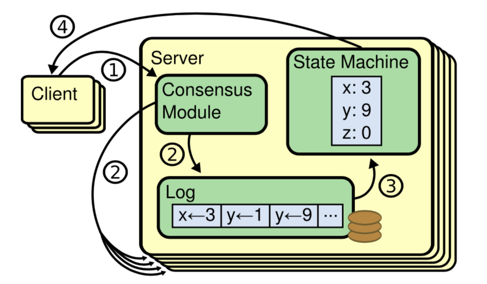
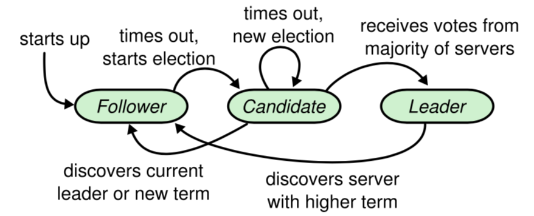
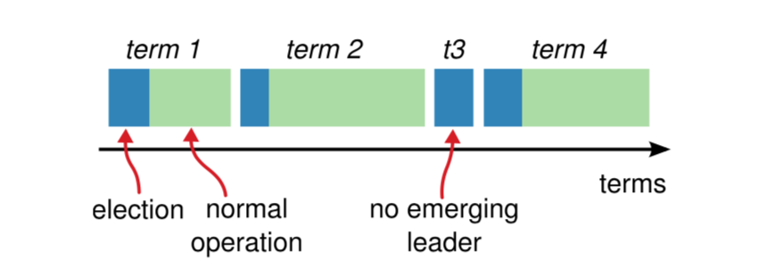
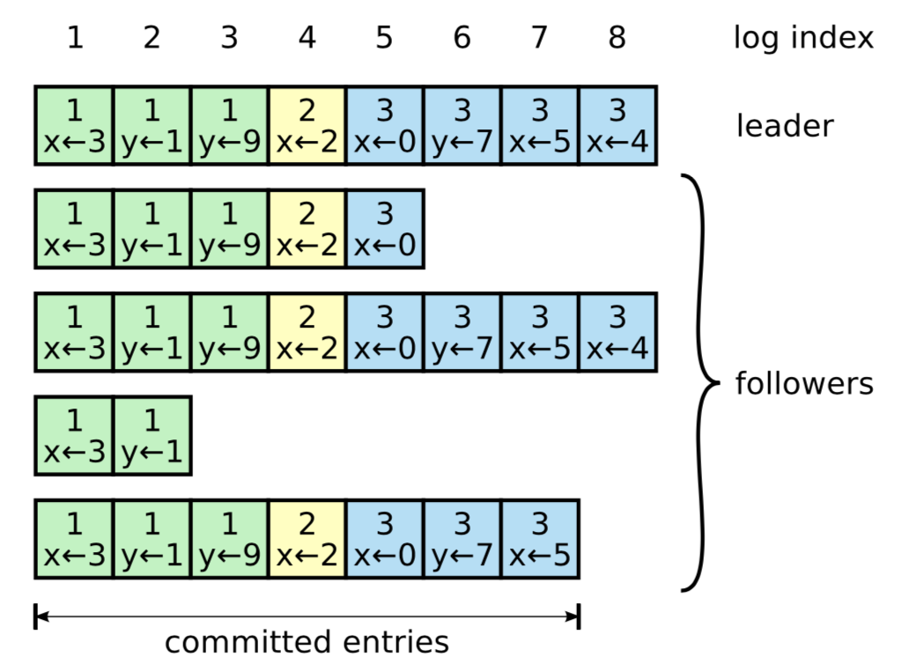
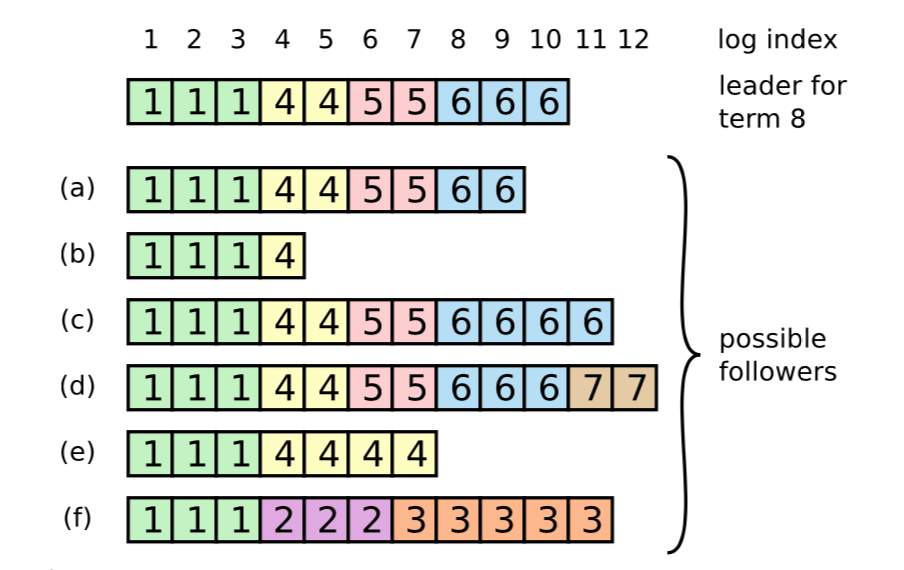
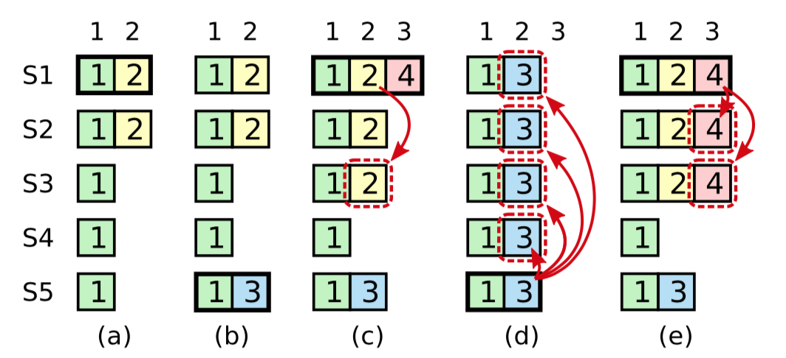
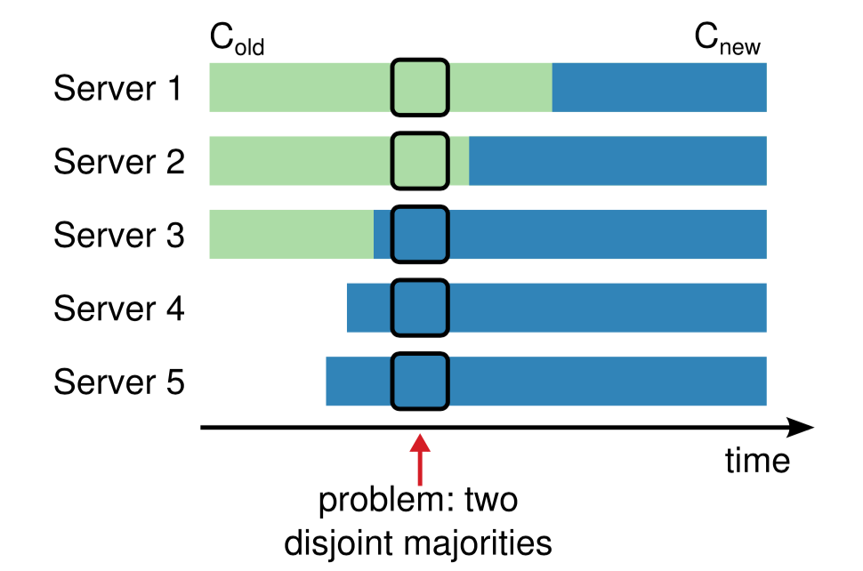

摘要
---

`Raft`是一个管理复制日志的一致性算法。提供等同于multi-Paxos的结果。它和Paxos一样高效。但是它和Paxos结构不同。Raft比Paxos更易理解，为构建系统提供更好的基础。为更易理解，raft切分一致性过程的关键步骤，如leader选举，日志复制，安全。它使用更强的一致性来减少必须被考虑状态的数量。Raft还包含了成员变更机制。通过重叠大多数来保证安全。


1、介绍
------

一致性算法允许一组servers以一致的group工作，并允许部分成员宕掉。因此它成为构建大规模软件系统的关键角色。Paxos一直主宰着一致性算法，很多算法都是基于Paxos或者他的衍生版本。但是Paxos太难了，Paxos需要经过复杂的修改才能适用真实系统。  
Raft易懂易建,其最主要目标是易懂。重要的不是它work，而是为什么可以work。

Raft更<font color=#c00>**易懂**</font>：
* **分解过程**：leader选举、日志复制、安全
* **合并状态空间**：不确定程度、server之间不一致的方式。

Raft和存在的一致性算法有点相似，但他有些<font color=#c00>**新特性**</font>：
* **强leader**：log只能从leader流向其他servers。易于理解，并方便管理日志复制。
* **leader选举**：使用随机计时器来选leader。只在心跳中增加少量的成本，高效容易解决冲突。
* **成员变更**：使用`joint consensus`（联合一致性）方法解决成员变更，使集群可以在配置变更过程持续完成操作。

2、复制状态机
-----------

一致性算法是在**复制状态机**的背景下提出来的。一组servers集上的状态机会为相同的状态计算相同的副本，这样即使有些server坏掉也可以继续操作。复制状态机用来解决分布式系统中**失败容忍**的一系列问题。它的一种典型实现是复制日志，如下图：

### 基本流程:
1. server上的一致性模块接收client命令
2. 一致性模块将其按一定顺序写入Log中，并与不同server间的一致性模块相互通信确定**Log顺序**
3. 状态机按照Log中的顺序执行命令
4. 将结果结果返回给client
   
### 如何保证输出相同？

|同时的条件|需要提供的保证|
--|--| 
|状态机是确定的|单机|
|状态机以日志的顺序处理命令序列|单机|
|不同Server的Log在相同位置上包含相同的命令|<font color=#c00>一致性算法保证</font>|
**一致性算法的任务保证复制日志的一致性（即使出现异常、失败等情况）**

真实系统中一致性算法通常有下面这些属性：
* 在所有**非拜占庭条件下都是安全**的（永远不会返回假结果）
  * *即使出现：网络延迟，分区，丢包、重复和重排序等。*
* 只要大多数Server能彼此通信并和客户端通信，Group就可用。
  * *例：一个五台Server的集群能够容忍2台失败。它们可能恢复并重新加入到集群中。*
* 不依赖**计时机制**来保证日志的一致性
  * *错误的时钟和极端的消息延时，在最坏的情况下会引起可用性问题。*
* 一般情况，一轮RPC过后，集群中的**多数派响应**，命令就能完成
  * *少数慢Server能影响整个系统的性能*

3、Paxos错在哪？
-------------

[Lamport](http://www.lamport.org/) ⊙﹏⊙‖∣° 怪我咯！


TODO: after read these papers
* [The Part-Time Parliament(1998,Lamport)](http://zoo.cs.yale.edu/classes/cs426/2012/lab/bib/lamport-paxos.pdf)
* [Paxos Made Simple(2001,Lamport)](https://www.microsoft.com/en-us/research/publication/paxos-made-simple/bibtex/)
* [Fast Paxos(2005,Lamport)](http://groups.ist.utl.pt/~meic-padi.daemon/papers/5-lamport-fast-paxos.pdf)
* [Paxos Made Live - An Engineering Perspective(2007,Google)](http://ondoc.logand.com/d/6162/pdf)

4、为易懂而设计
------------

raft有一系列的设计目标
* 有效的减少开始者设计的工作量
* 在所有条件下都要安全可靠，典型操作可用性要保证
* 常规操作要高效
* 最重要——<font color=#c00>易懂</font>
  
详细说道一番设计时如何取舍的，主要有两个方法：
* 问题分解，把问题切成不同的小块，每块都容易解决相对易懂，
  比如切分leader选举，日支复制，安全和成员变更。
* 简化状态空间，减少需要考虑的状态数量，使系统更清晰且去掉不确定的成分。
  日志不允许有空洞，并且限制了日志不确定的场景。
  尽管大多数情况下我们尝试消除不确定性，但有些场景下不确定实际上更易懂。比如，随机方法引入了不确定，使用随机方法可以简化leader选举。

5、Raft一致性算法
---------------

raft通过选择一个强leader，然后让leader管理复制log的完整任务。
leader从客户端接收log entry，然后复制log到其他的servers，并告诉他们什么时候应用日志到他们的状态机中是安全的。
一个leader可以简化日志复制的管理。比如，leader可以在不需要和其他server商议的情况下就决定一个entry放到日志中的哪个位置。并且数据流简单的从主流向其他server。
leader可以宕机或者和其他servers断连，如果是那样的话会选一个新的leader出来。

raft分解一致性问题到3个相对独立的子问题
* **leader选举**
  当一个已存在的leader失效了，新的leader必须被选出来。
* **日志复制**
  leader从client接收命令写入日志，并在集群中复制。
  强制其他Log同意它自己意见。
* **安全性**
  raft中最关键的安全属性——状态机安全属性
  如果任何一个server已经应用特定的log entry到它的状态机。
  那么没有任何一个server可以在相同的log index 处应用其他命令。
  raft实现这个安全属性，依赖选举机制中附加的限制条件。

### 5.1、raft基础

一个raft集群包含数个server，5个是一个典型的数量，可以容忍两个服务失败。
在任何一个时间点，一个server都可能会是下面是下面3个状态之一：
* leader
* follower
* candidata （候选人）

正常情况下，会有一个leader, 其他全部是follower。
follower是被动的，除了简单答复leader和candidate的请求以外，不处理任何请求。
leader处理client的所有请求，如果client的请求打到follower上，follower负责把请求重定向到leader，candidate负责选出一个新的leader


raft把时间切成一段一段的，每段叫做一个term，term是连续的整数编号的。每个term开始于一个新的选举:
* 成功选举（一个或多个candidate企图成为leader,没出现平票），leader管理整个集群，直到term结束
* 失败选举（出现平票），这时候没有选出leader，term就结束了
raft确定一个term中最多一个leader


不同的server观察到的term间转换可能发生在不同的时时间，在某些场景下有个server有可能观察不到一个选举过程甚至整个term（s）。
terms在raft中担任逻辑时钟的角色，并且terms允许servers观察到旧的leaders。
每一个server保存current_term_no，term号随时间流逝单调增。
当server间通信的时候current_term_no可能被替换，如果一个server的current_term_no比其他的server的小，那么他会更新current_term_no到一个更大的值。如果candidate或者leader发现自己的term已经超时了，它立即把自己的状态变成follower,如果一个server收到一个带着旧的term号的请求，它拒绝这个请求。
raft服务间通过rpc进行通信，一个基本的一致性算法，需要两种类型的rpc。
* RequestVote rpc，由candidate在选举的过程中初始化
* AppendEntry rpc， 由leader初始化，在复制日志过程，并且会提供心跳状态。
* 第三种类型的rpc，用于server之间传输快照

server会重试rpc，如果他们一段时间没有收到回复的话，并且为了高性能他们会并行发起rpc。

### 5.2、leader选举

raft使用心跳机制触发leader选举，当服务启动的时候他们都是follower，只要有从candidate或者leader发起的有效的rpc被server收到，它就一直停留在follower状态。为了维护权威leader周期性的发送心跳,通过不带log entry的 AppendEntry rpc完成心跳传输。如果一个follower在一段时间内（election timeout）没有接收到通信，然后它会假设没有可用的leader存在，开始一轮新的选举。开始一个选举，follower会增加它的current_term_no，并且改变自己的状态为candidate。它先给自己投一票，然后并发的发送RequestVote请求给集群中的其他server，一个candidate会在下面3个事情有一个发生的时候退出这个状态
* 它赢得选举了（赢了）
* 另一个candidate确认自己是leader（败了）
* 过了一段时间但是没有leader被选出来（平票）

如果一个candidate在同一个term中赢得了集群中大多数机器的选票，我们认为这个candidate赢得了选举。在给定的term中某个机器最多只能给一个candidate投票，基于先到先服务的原则（5.4还有个附加条件）
大多数规则保证在特定的term中最多有一个candidate能够赢得选举，当一个candidate赢得了选举，他会成为leader。随后它会发心跳给所有其他的server，确认自己的权威，并且阻止新的选举。

在等选票的过程中，candidate可能会收到一个来自于声称自己是leader的其他server发送来的AppendEntry RPC请求，
* 如果这个leader的term号大于等于这个candidate的term，这个candidate会承认leader的合法性并且返回follower状态。
* 如果这个leader的term号小于这个candidate的term，那么这个candidate拒绝这个rpc并且继续candidate状态。

第三种可能就是这个candidate没赢也没输：如果同一个时间有多个candidate产生，票会被切分。所有candidate都没有得到大多数选票。当这种情况发生，每个candidate会超时并且开始一个新的选举增加它自己的term号并且初始化另一轮RequestVote rpc。如果没有附加的限制分票（split vote）行为可能会持续进行下去。

raft通过随机超时保证极少会出现选举分票，即使出现也可以很快恢复。
为了阻止最初的分票，选举超时随机从一个小区间选（150-300ms）。通过这个方法可以分散server的超时时长，大多数的case中只有一个server会超时，它赢得选举并且在其他server都没超时前发送心跳。
相同的机制去处理分票，一个candidate在发起一个新的选举时会重置一个新的随机超时时间。并且在开始下一次选举前它等待这个超时时间的到来。这会减少在新一轮选举中分票的可能性。

对于选举，作者也想过用排序的方式，每个candidate分得唯一个位置，选举过程如果位置靠前的candidate会更容易当选，但是这也会出现可用性问题，当出现排序靠前的candidate失败的时候，排序靠后的candidate需要等待一个超时时间然后发起一个新的选举。

也想了其他的一些方法，作者觉得这些方法都有各种各样的问题，最后选了易懂易实现的随机超时的方法来选leader。

### 5.3、日志复制

当leader被选出来以后，他开始服务于client，每个client的请求包含一个要被复制状态机执行的命令。leader 追加这个命令作为它自己log的一个新entry，然后并行的发AppendEntry RPC到其他的server上，当这个entry被安全的复制了，leader应用这个entry到他的状态机中并且返回执行结果给client。如果followers crash或者比较卡，又或者丢包了，leader会无限期的发AppendEntry rpc（尽管这时候它已经响应client），直到所有的follower最终保存了所有的log entry。

日志的组织如下图，每一个Log由顺序编号的entry组成，每个entry中包含一个创建它时候的term对应的term号和一个状态机执行的命令。如果一个entry被应用到状态机中会被认为是commited。
log entry中的term号用来发现log间的冲突。每个log entry包含一个整数索引，表示它在log中的位置。


raft保证所有commited entry都是持久的。并且最终会被所有可用的状态机执行。一个log entry在创建它的那个leader复制它到集群中的大多数server以后才会被提交。如上图中的entry[7],也会提交当前leader log中所有之前的entry，包括前面leader遗留下来的entries

leader保有着所有commited entry中最大的index，并且在后面的AppendEntry rpc（包括心跳）过程中会携带这个index，因此其他的server最终都会发现。当一个follower发现一个log entry已经被提交了，它会按照log index的顺序依次把对应entry的命令应用到状态机。

raft log机制使其更安全，这个不同于一般的server log。

日志一致属性：
条件：*如果*在不同log中的两个entry，他们具有相同的index和term
* *那么*这**两个entry**存储相同的命令
* *那么*在**不同的log**间所有前面的entry都是一样的
第一个属性依赖一个事实：leader在一个term中对于一个给定的log index最多只能创建一个entry，并且entry永远也不会修改他们在log中的位置。
第二个属性通过AppendEntry做简单的一致性检查就可以保证。当发送一个AppendEntry RPC的时候，leader会发送一个即将会出现的entry的index和term给其他的server，如果follower发现在log中没有找到一个拥有相同index和term的entry，随后他会拒绝这个新来的entries。
一致性检查实际上是一个归纳的步骤，日志初始空的状态满足日志一致属性，并且一致性检查在日志增长的时候保持日志一致属性。
也就是，当AppendEntry 接口返回成功，意味着leader知道follower的log在通过新的entry时是和它自己的一样的。

正常情况下AppendEntry一致性检查不会失败。然而当leader crash的时候能够导致一致不一致（老的leader可能没有全部复制他log中所有的entry）。这种不一致可能会因为一系列leader和follower crash而出现混乱。

follower的log可能和新的leader不同，一个follower可能缺失一部分当前leader有的entries，也可能有一部分 当前leader没有的，或者这两种情况同时存在。 log中的缺失和多余entries可能跨多个term。

如下图例子：

当最上面的leader开始工作的时候，a-f这些follower可能会出现下面的任何一种情况。
follower a,b 缺少entry
follower c,d 有没提交的entry
follower e,f 同时出现上面的两种情况，有部分缺失，有部分又多余。
图中的f，可能场景是这样的：在term2 的时候它是leader，增加了4，5，6三个index的log entry但是还没来的及replicate 给其他follwer的时候，它挂了。随后它被迅速的拉起，又成为term3的leader，紧接着他又增加了7，8，9，10，11 五个index，在这个过程中term2和term3的entry没有一个来得及被commit，紧接着他又挂了，然后连续错过了4，5，6，7这4个term.

在raft中，leader通过强制follower复制自己的log来处理前后不一致的情况。这就意味着follower的log中冲突的entry会被leader的log中的entry重写。
为了保证folwer日志和leader自己的一致，leader必须找到它和follower都认可的最新的entry。删掉follower上比这个点更新的entries，并且leader自己这个点之后的所有entries都发送给follower。这些都发生在做一致性检查的AppendEntry RPC 响应中。leader维护一个 nextIndex[followers[i]],用来索引下一个要给某个followers[i]的log entry。在一个leader第一次work的时候，它会初始化所有nextIndex[followers[i]] 使其为当前所有entry中最新的下一个，上图中的（index:11）,如果一个follower的日志和leader的不一致，在下一次AppendEntry RPC中做的AppendEntry一致性检查就会失败。当leader得到一个来自follower的拒绝之后，leader会减小 nextIndex[followers[i]] 然后重试，最终一定会达到一个点，这个点能保证leader和follower是匹配的。当匹配之后AppendEntry 就会成功，删掉follower日志中所有冲突的entry并且追加来自leader日志中的entry。只要AppendEntry成功，那么follower和leader的日志就是一致的。在余下的term过程中，leader会继续做这些。

这个协议可以优化缩小AppendEntries RPC 拒绝的次数。例如，当一个AppendEntries RPC请求被拒绝了，follower可以在响应中，带上冲突entry的term和它在这个term内的第一个index。通过这些信息，leader可以跨过那个term的所有冲突的entry；一个AppendEntries RPC 每个term粒度，下面所有冲突的entries。还是每个entry粒度。在实践中我们怀疑这个优化是否是必要的，首先失败是低概率的，并且通常冲突的entries并不是很多。

有了这个机制，当leader当他单选的时候，不需要花费任何特殊的操作，来保持日志的一致。它只需要正常的操作，在AppendEntries的一致性检查失败的响应中log会自动转化。**一个leader永远都不需要删除或者重写它自己的log**

只要server中的大多数活着，raft就能接受、复制、应用log entry。通常情况下经过一小轮RPC就能够复制一个log entry，并且在出现慢单节点不会影响整体的性能。

### 5.4、安全

到目前为止，前面描述的这些机制不能够确切的保证每个状态机按照相同的顺序执行相同的命令。比如一个follower可能在leader正commit一些entry的过程中不可用了，随后它可能被选成了leader，并且重写这部分entry，导致一个结果就是不同的状态机可能执行不同的命令。
这部分增加一个限制——谁可能被选成leader。
这个限制条件保证leader对于任意给定的term包含所有在之前的term中就已经提交的entries。（leader完整特性）

#### 5.4.1、选举限制
在任何基于leader的一致性算法中，leader必须存储所有的已提交log entries。有些一致性算法，在选leader的时候不限制它是否包含所有的已提交entires，这些算法存在附加机制去区分未提交的enties，并将其发送给新的leader。这个过程发生在选举阶段或者那之后的一小段时间。不幸的是，这样会有很大一坨很复杂的附加机制。raft使用一个简单的方法保证所有在前面的term中已经提交的entries出现在一个新的leader当选的那一刻。不需要传输这些entries到leader上。这就保证了log entries只有一个流向——从leader到followers。leader从来不会重写已经存在它log中的entries。
除非一个candidate包含所有已经提交的entries，否则raft会使用投票的过程来组织它当选。为了当选candidate必须和集群中的大多数通信，这也就意味着任何已经提交的entries至少会存在于大多数中的一台server上。
如果condidate持有的log至少是所有大多数log中最新的，那么它会保有所有已经提交的entries。RequestVote RPC可以实现这个限制：RPC包含candidate的log信息，并且选民们如果发现自己的log比candidate的更新它会拒绝这个condidate的选票。

更新的定义：raft通过比较两个log中最后一个entry的index和term号来确定谁是最新的。如果log最后一个entry在不同的term中，则持有更新的term的那个log认为是最新的，如果log最后是相同的term，则更长的log更新。

#### 5.4.2、提交那些来自先前term的entries
leader知道一个来自于当前term的entry一旦被集群中的大多数保存了，就是提交了的。如果一个leader在提交entry之前就挂了，未来的leader将试图完成复制这个entry。然而一个leader不能够立即确认一个来自之前term的entry一旦被集群中的大多数保存了就是已经提交的了。
下图描述了一个场景：旧的log entry 存储在servers中的大多数，还能够被新来的leader重写。


为了避免上图中的这种问题发生，对于来自于term的entry，raft不通过计算副本数来提交。只有那些来自于leader当前的term的entry才通过计算副本数来提交。一旦当前term的entry通过这种方式提交了，那么之前的entries也被间接的提交了。依赖于前面提到的日志一致属性。其实有很多场景leader是可以马上知道前面的entry已经被提交了的（比如所有的副本都被保存了）但是raft为了简洁选择了最保守的方法。

#### 5.4.3、安全争论
给出完整的算法，现在关于拥有leader完整属性我们可以讨论的更清晰。通过反证法，假设不具有leader完整属性，得出一个矛盾。

假设隶属于某个term t1的leader Leader[t1].在t1内提交了一个log entry E，但是E没有被未来的某个term t2的leader Leader[t2]保存。t2>t1,且t2是所有大于t1中最小的一个。

1. E在Leader[t2]任期中其log内不存在。因为leader不能删除和重写entry。
2. Leader[t1]复制log到集群中的大多数，Leader[t2]是从集群中的大多数获得的选票，那么至少有一个V（follower[x]）即投票给了Leader[t2]，又接到了这个来自Leader[t1]复制过来的E。
3. V一定是先接到了来自Leader[t1]的复制请求，后投票给Leader[t2]的。否则它会因为接受Leader[t2]后term变为t2，t2>t1而拒绝来自于Leader[t1]的AppendEntry RPC。
4. V在投票给Leader[t2]时保有E，
5. V把票投给了Leader[t2]意味着Leader[t2]的日志要比V的更新。
6. case1，如果如果V和Leader[t2]拥有相同的最后一个term，那么Leader[t2]的日志至少和V的一样长，这时候它会包含所有的V的entry
7. csse2，Leader[t2]的最后一个term必须比V的大，此外也比t1大。因为V的最后一个term至少是t1（V包含了来自t1的E）

### 5.5、follower和candidate异常

通过相同的方式处理follower或者candidate宕掉，方式相对简单。出现问题是发送给他们的AppendEntries和RequestVote RPC会失败，raft通过反复retry的方式，如果宕掉的服务重启了，那么会成功的完成RPC。如果在处理完RPC之后宕掉了，但是没有响应，那么它在重启之后会收到相同的RPC。因为Raft中的RPC是幂等的，因此无害。比如，一个follower接受AppendEntries RPC中的entry已经在它自己的日志中，在新的请求中它会忽略这部分entry。

### 5.6、计时和可用性

Raft的一个需求是安全性不能依赖于计时，系统不能因为某些事件发生的快或慢而出现不一致的情况。然而可用性必须要考虑计时，比如消息交换比server宕掉的间隙还长的话，那candidate将没有足够的时间赢得选举，没有稳定的leader，raft就无法进行下去。

leader选举时raft中很关键的一个方面，只要系统满足下面的时间要求，raft就可以选出并且维护一个稳定的leader。

```broadcastTime << electionTimeout << MTBF```

* `broadcastTime`是server并行发送RPC到其他的server并受到响应的平均时间
* `electionTimeout`在之前描述选举超时的时候描述了
* `MTBF（Mean Time Between Failure）`是server的平均故障时间

`broadcastTime`低于`electionTimeout`一个数量级，这样leader可以稳定的发送心跳维护任期内的followers
`electionTimeout`低于`MTBF`一个数量级，保证系统可以稳定的持续下去


`broadcastTime`和`MTBF`依赖于系统的底层，因此我们就只需要考虑`electionTimeout`。
raft中的rpc信息通常是需要存到持久化存储中的，所以广播范围在0.5ms-200ms之间，主要依赖于存储技术
因此`electionTimeout`选举超时时间通常在100-500ms为宜，`MTBF`通常是月级的，因此很容易满足需求。

6、集群成员变更
-------------

到目前为止我们认为集群的配置都是固定的。在实践中，配置偶尔需要变更：当出现server宕机，或者改变服务的副本数量时。
尽管可以通过修改停服修改，那就没什么可用性可以谈了。另外手工的操作也会引入错误风险，为了解决这个问题把自动配置变更合入了Raft中。

对于配置变更的安全性就是：**在变更过程中不能存在一个使得不同的leader共用了同一个term的点**。

不幸的是直接从旧的配置切换到新的配置上是不安全的，因为不可能原子的同时切换所有server上的配置。因此集群在切换的过程中可能出现两个独立的大多数（选出两个主，脑裂了）
具体如下图：


为了确保安全，配置的变更必须是两阶段的。在raft中集群切换到一个过度配置，被叫做`joint consensus`命令。当`joint consensus`命令被提交，系统随后过渡到新的配置上。

`joint consensus`命令混合了新老配置，有3个规则：
* 【规则1】log entry会被复制到所有新集合C[new]和老集合C[old]中的的server
* 【规则2】新集合C[new]和老集合C[old]中的的server都可以成为leader
* 【规则3】只有同时赢得老集合C[old]的大多数和新集合C[new]的大多数，才能当选leader或者完成entry的commit

集群配置通过保存和提交`joint consensus`命令完成。
1. leader接到配置变更请求：C[old]->C[new]
2. leader保存C[old,new]到log中，并且根据【规则1】复制到所有新老集合的server上。
3. 一旦某个server保存C[old,new]到自己的log中，在未来的决定中它会应用这个C[old,new] (server在应用某个配置的时候不关心它是否被提交了，收到保存就应用)
4. 根据【规则2】两个集合中的大多数follower都确认了C[old,new]命令，leader会提交C[old,new]
5. 如果leader挂了，根据【规则2】新的leader可能是新集合或者老集合中的server，主要取决于获胜的candidate是否已经接到C[old,new] 
6. 在这个阶段C[new]都不能独立的做决定。
7. 一旦C[old,new]被提交了，无论C[old]还是C[new]都不能够不经过对方的同意做决定【规则3】，
8. 这时，根据Leader完整属性可以保证只有持有C[old,new]配置的server可以当选为leader
9. 这时候leader创建C[new]保存并复制到followers中，很快大多数follower会应用C[new]，当C[new]被提交之后，那些只在老配置中出现的server会被下掉。
10. 因此C[old],C[new]在任何时候都不能同时做决定。

上面的描述会有3个问题：
* 新加入的server没有前面的日志
  * 在配置变更前，它需要先**加入到集群中，不参与投票，也不做大多数统计，先追上日志**。随后才能开始配置变更。
* leader不在C[new]中，
  * 在这种情况下leader提交完C[new]以后会把自己的状态变为follower。
  * 在C[new]提交过程中，会出现leader管理的集群，并不包含leader的问题。
  * **leader复制C[new]给其他的server，但是统计大多数的时不计算自己。**
  * C[new]提交之后会重新选leader。
* 那些不在C[new]中的server可能让集群混乱。
  * 详述：这些机器不会受到心跳，他们会超时然后开始新一轮投票。通过RequestVote RPC发一个新的term号，这就会引起当前leader重返follower状态，即使新的leader被选出来，这个过程还是会反复的出现，导致集群不可用。
  * 解法：server如果认为**当前的leader是存活的**，那就不会接受RequestVote RPC —— 当server在最小选举超时时间范围内接到RequestVote RPC，它不会更新term也不会投选票。follwer在准备开始一轮选举之前它会等待一个最小选举超时时间。这就保证了只要leader能够得到心跳它就不会因为更大的term号被罢免。

7、Log Compaction
-----------------

日志太长，在实践中需要更多的空间保存，更多的时间做重放。新成员加入后追赶成本更高。
通过快照机制，
* 每个server独立的做快照，互不影响
* 快照只覆盖已经提交的entry
* 通常是状态机完成快照的生成工作，把自己当前的状态写入快照
* 快照中包含少量员信息：
  * `lastIncludedIndex`  日志中要被快照替换的所有entry中最后一个的index，替换过程需要在entry被状态机提交之后。【for AppendEntry一致性检查】
  * `lastIncludedTerm`   上面提到的`lastIncludedIndex` entry所在的term 【for AppendEntry一致性检查】
  * `lastIncludedConf`   [可选] 截止`lastIncludedIndex` entry使用的配置。【for 成员变更】
* 快照被写入后`lastIncludedIndex`之前的log就可以被清理掉了。
* 当leader发现某个需要传给follwer的entry已经不在自己的log中了（在快照中），它会在后台偶尔把自己的快照传给follower。
  * 新成员加入
  * 慢节点出现
* 通过 InstallSnapshot RPC 发送快照给follower，当follwer接到这个RPC以后它需要决定对于它已经存在的log entry如何处理。
  * 通常情况下快照中会包含复制log中没有的信息，follower抛弃自己的entry log, 完全由快照取代。
  * follower可能接受一个快照，是他log的一部分前缀（可能是因为错误或者重传等原因）那么被快照覆盖的部分log使用快照，没有没覆盖住的部分，log需要保留。
* 快照方法背离了raft的强主思想，作者觉得是有用的，本来leader就是用来解决冲突达到一致的，通过快照可以直接做到没有冲突。
* 可供选择的方法：leader-based方法。只有leader生成快照，再由leader把快照发给follower
  * 网络带宽浪费，拖慢快照过程，follower信息都有，在本地处理快照成本低于处理网络的快照
  * leader实现会变复杂

* 两个问题会对快照性能带来影响：
  * 什么时候做快照，（1）如果快照的太频繁会浪费磁盘、带宽、功耗；（2）如果频率太低，首先存储扛不住，其次会影响重启以后日志的回放。
  一个简单的方法是，当log到达一个固定的size之后做一次快照，如果这个size比生成的快照的size大很多，那么消耗在快照上的磁盘和带宽成本会相对低。
  * 写快照会消耗一部分时间，不想被快照拖慢正常的操作。copy-on-write方法，快照写入和更新不发生冲突。（1）在状态机中实现一个支持copy-on-write的数据结构，（2）直接用linux的fork做一个完整的状态机只读镜像。

8、客户端交互
-----------

主要说两个事：
* client如何找到leader
  * client随机连一个server，如果不是leader会被拒绝，并且在相应中带上它之前接收到的leader地址给client（AppendEntries RPC里面包含leader address）
  如果leader挂了，client的请求会超时，然后重试随机选个server
* raft如何满足可线性化语义（线性一致性）
  * 到目前为止描述的raft可以执行一个命令多次。比如，leader提交entry以后响应客户端之前挂掉了，client给新的leader发同样的命令，导致第二次执行。解决的办法是客户端分给每一个command一个唯一的sequenceId，状态机跟踪每个client的最后一个sequenceId。如果发现新到command的sequenceId已经处理过了，直接返回响应，不执行。
  * 只读操作不需要像日志中写任何东西，不做任何限制会有读取到旧数据的风险出现。旧leader可能在不知道新leader已经废弃掉某个entry的情况下响应对应entry的请求。
  可线性语义需要保证不能读到旧数据。raft需要两个附加的措施保证这些，而不使用log
    1. leader必须拥有一个提交后的entry的最新信息。leader完整性属性保证了，它拥有所有已经提交的entry信息，但是在新当选的term开始时，leader并不知道这些，它需要提交一个blank entry（no-op）在其最初当选的时候。
    2. leader必须在接受一个只读请求的时候确定自己是不是还在位。raft通过让leader在响应之前和集群中的大多数做心跳信息的交换，或者leader依赖一个租约的机制，但是这个是需要依赖时间偏序（不跳变）
