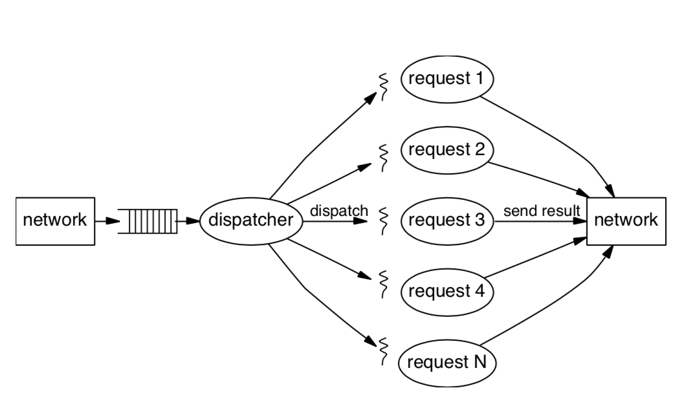
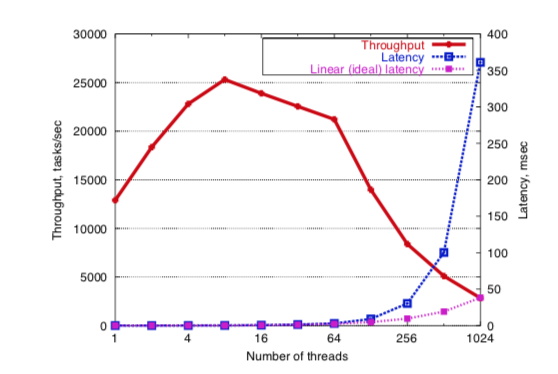

DEAD：一个用在良态和可伸缩互联网服务上的框架
=====================================

摘要
===
我们针对高并发互联网服务提出了一个新的设计，叫它staged event-driven architecture（SEDA）。SEDA想要支持严苛的并发需求并且简化良态服务的构建。在SEDA中，应用由一个被显式队列连接的事件驱动阶段网络组成。这个框架使服务更好的适应负载，防止当需求超过服务阈值时资源被过量使用。SEDA使用一个动态资源控制器(dynamic resource controllers)集来保持即使较大的负载波动情况下，stage也会在controller的控制范围内。我们描述一些列控制机制来自动调节和负载调节，包括线程池的大小，事件批量，和适应的负载分散。我们展现SEAD的设计和一个基于这个框架的互联网服务平台的实现。我们通过两个应用评估SEDA的使用：一个高性能的HTTP服务器和一个P2P文件共享网络Gnutella的包路由器。这些结果显示SEDA应用比传统应用设计具有更高的性能，并且针对较大变化的负载有更好的鲁棒性。

1、介绍
======

互联网使得一个计算机系统问题变成空前的规模：支持数百万用户访问的服务必须低延迟，鲁棒，并且一般情况下是可用的。并发session的数量和网站每天的点击率转换到一个更大量的I/O和网络请求，对底层资源的需求更是大。雅虎每天页面访问量12亿，AOL的网络缓存服务每天100亿命中。此外互联网服务有较大的服务负载波动。Slashdot Effect显示通常一个站点变得流程了会有超过100倍需求增长。针对互联网应用的需求增长，新的系统设计技术必须用来管理这些负载。

* 服务自己变得复杂，动态内容替换静态内容，需要更多的计算和IO
* 服务逻辑变化频繁，增加了工程和部署的复杂性
* 服务在通用目标上增长，而不是只针对某个特殊的服务（和目前的微服务观点相悖）

我们只关注性能方面的问题:在比较宽泛的服务遭受巨大的负载波动时性能的鲁棒性。

复制是服务伸缩性的关键方面。给出一个服务实例能够维持一个确定的性能级别，它必须通过复制来维持很多倍增长的负载。然而高峰负载可能比均值大很多，因此复制很多服务来处理潜在的最大需求是不实际的。所以，我们认为每个节点锁精力的负载是有较大尖峰的。

我们的目标是：开发一个通用框架来构建能够优雅处理负载的高并发和良态服务实例。

不幸的是传统的操作系统设计和对并发的广泛的优化模型都没有提供一个优化的方式管理负载。商业操作系统聚焦在提供最大的透明性通过给每个线程提供一个有CPU，内存，磁盘，网络的虚拟机的抽象。这个目标和重高并发、全面控制资源使用的互联网服务的需求不太一致。进程和线程可以很好的支持并发编程，但是经常会出现较高的上下文切换时间和内存占用。资源虚拟化的透明性阻碍了应用作出有依据的决定，这些对管理过高的负载是必不可少的。

很多工作对一些特殊服务的性能和鲁棒性聚焦。然而随着服务的动态和弹性的增长，工程上的负担变得沉重了。只有少量的工具能够在开发高并发、良态服务商提供帮助；我们的目标是提供通用的机制来降低这种复杂性，这些通用的机制可以帮到需要获得这些属性的软件开发者。

我们为高并发服务提出一个新的设计框架，叫staged event-driven architecture (SEDA).SEDA包含线程和事件编程模型的方面，它用来管理互联网服务需要的并发，IO，调度和资源管理。在SEDA中，应用由stage的网络构成，每个stage关联一个入口事件队列。每个stage相当于一个鲁棒的构件，它可能通过阈值和过滤它的事件队列来独立应付负载。另外，使得事件队列明确的允许应用知悉调度和资源管理的决定，如对请求的重排序、过滤或者汇聚。SEDA使用（dynamic resource throttling）动态资源调节控制应用组件的资源分配和调度，允许系统自适应负载状况。

这个论文描述一个机遇SEDA的互联网服务平台的设计，架构和实现。这个平台提供高效可伸缩的IO接口，此外还有一些资源控制机制，包括线程池大小和动态事件调度。我们通过两个应用评估这个框架——高性能HTTP服务和P2P文件共享网络Gnutella的包路由器。我们给出这些应用的性能和伸缩性结果，表现出SEDA在较大负载波动时的鲁棒性要胜过其他的系统设计。5.1节描述了我们基于java实现的SEDA HTTP服务胜过两个流行的基于C实现的网络服务。我们讨论了使用SEDA后，高并发应用更容易构建，有更高的性能，并且对负载更鲁棒。带有正确的接口集合，应用开发者能够聚焦到应用逻辑本身，而不是更多的关注并发和资源管理。

2、背景和相关工作
==============

SEDA整合了两个重要的研究路线：使用让编程简单化的基于线程的并发模型和为了大规模并发的基于事件的模型，这一章在通向SEDA设计的进程中通过勾勒关键的贡献和问题来描述这个方法的世系。

一个服务是良态的如果他的行为像一个简单的管道。管道的深度是明确的——是经由网络和服务内部各阶段的路径。当负载增加，吞吐也随之增加直到管道变满进而吞吐饱和。多余的负载不应该使吞吐降低。类似的，在服务负载低的时候响应时间应该初略的看成是个常数，因为它是由管道的深度所决定的。当负载接近饱和时队列延迟占据统治位置。

很多服务典型的闭环方案是每个客户端在它发起下一个请求之前等待一个响应，响应时间应该随着客户端数量的增多线性的增加。

一个良态系统的关键属性是优雅的恶化：当负载超过阈值时，服务维持一个高吞吐，响应时间线性的恶化。均匀的影响到所有的客户端 或者至少可预见根据某个服务特定的策略

值得注意的这不是一个典型的网络服务经验；相反的，随着负载的增加，吞吐降低并且响应时长突增，好像系统挂掉了一样。

2.1、基于线程的并发
================

服务端的应用很多通常的设计是线程每请求（thread-per-reqeust）模型，这个模型被现代编程语言和环境支持的很好。在这个模型中，如下图所示，每个接到的请求消耗一个线程去处理它，伴随着同步的操作保护着共享的资源。线程间的切换显然引起了操作系统重复的运算和I/O。

虽然比较容易编程，和线程相关的成本——包括cache和TLB miss，调度成本，锁竞争 —— 当线程数量变大后会出现严重的恶化。如同一个具体的实例，如下图 显示了一个单线程服务和线程数量增加时的性能。尽管对于通用目的的分时系统来说实际的线程限制应该很大，但是还不能瞒住互联网服务极大的并发需求。

线程和进程主要设计用来支持多道程序设计，并且存在的操作系统力争虚拟化硬件资源对应用透明。应用很难有机会参与到系统端资源管理的决定中，或者为了适应他们的行为来调整状况给出资源可用性标记。虚拟化基本上隐藏了资源被限制和共享的事实。

一些系统已经开始关注改进这个问题，通过暴露给更多的控制给应用。然而，这些系统的设计依然基于多道程序设计，持续关注在资源虚拟化的安全和高效上，而不是优雅的管理和高并发上。

2.2、固定大小线程池
================

为了避免线程的滥用，一些系统根据负载条件比较粗粒度的分配一个固定大小的线程池来提供服务。当请求数量超过某个上限，后续的请求将不能被接受。通过限制线程数，服务能够避免吞吐恶化，并且整体性能比无约束线程每任务（thread-per-task）模型更鲁棒。然而这个方法能够引出对客户端不公平的问题：当所有服务线程忙碌或者阻塞时候，客户端请求队列队列为了得到服务等候在网络中。这能够引起客户端任意的长时间等待。

2.3 事件驱动的并发
================

2.4 结构化事件队列
================

3、分阶段事件驱动框架
==================

3.1、目标
========

3.2、阶段作为鲁邦的构建块
=====================

3.3、应用作为阶段的网络
====================

3.4、动态资源控制
===============

3.5、Sandstorm：一个SEDA的原型
============================

4、原始的异步I/O
==============

4.1、异步网络I/O
---------------

4.2、异步文件I/O
---------------

5、应用和评估
===========

5.1、Haboob：一个高性能的HTTP服务器
-------------------------------

### 5.1.1、Haboob架构 ###

### 5.1.2、Benchmark配置 ###

### 5.1.3、性能分析 ###

### 5.1.3、有适应能力的负载分散 ###

5.2、Gnutella的包路由
-------------------

### 5.2.1、架构 ###

### 5.2.2、来自慢套接字的保护 ###

### 5.2.3、负载条件行为 ###

6、讨论和结论
===========

