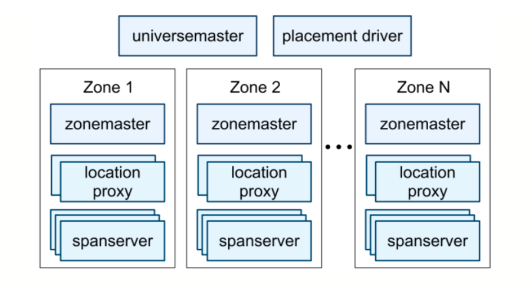
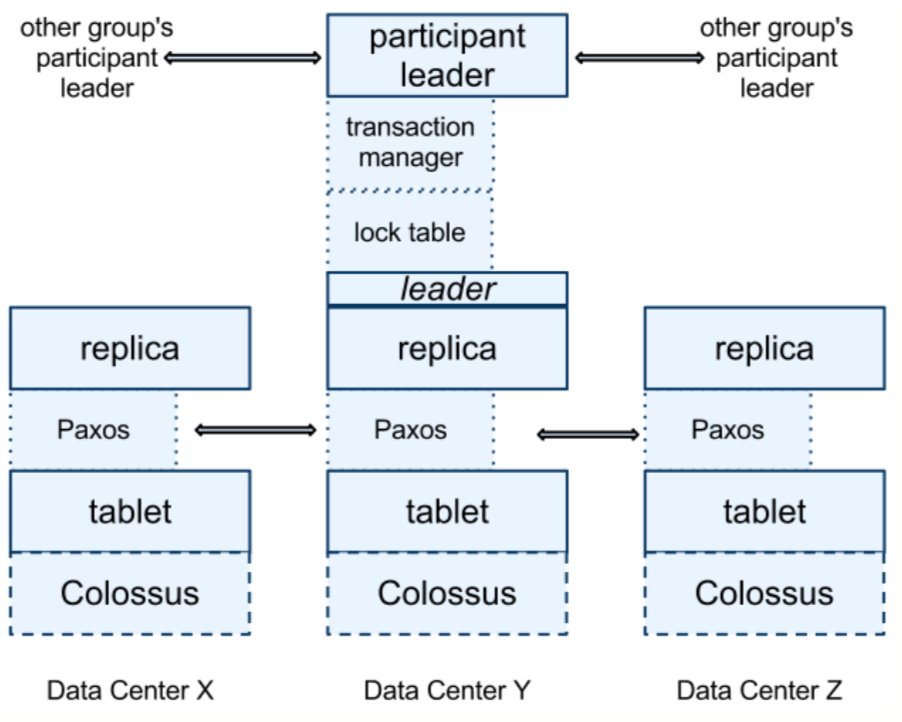

摘要
===
Spanner是google的可伸缩、多版本、全球分布式、并且同步复制数据库。它是第一个在全球分布数据并且支持外部一致的分布式事务。
这篇论文描述Spanner的结构、特性集合、一系列底层设计抉择的依据，和一个暴露时钟不确定性的新时间API。
这个API和它的实现是支持外部一致性的关键和一系列给力特性：以往的非阻塞读、无锁只读事务、原子模式变更，贯穿了整个Spanner。

1、介绍
======
Spanner是一个Google设计、构建、部署的可扩展、全球分布式数据库。它是一个把数据分散到在全球数据中心的很多paxos状态机集合中的数据库。复制用于全球的可用性和地理定位。客户端在副本间自动恢复。Spanner在机器数量变化和数据量变化的时候自动分散数据到机器中。并且在机器间自动迁移数据（甚至是跨数据中心）来均衡负载和响应失败的情况，Spanner被设计能够扩展到百万个机器，跨数百个数据中心和万亿级别的数据库行。
应用为了高可用可以使用Spanner，即使在面对大规模的自然灾害的时候，通过在大洲内和间复制他们的数据。我们最初的用户一个重写的google广告后端——F1。F1在美国境内分散5副本。很多别的应用在一个物理区域内可能跨3-5个数据中心复制他们的数据，但是伴随着相对独立的失败模式。大多数的应用会选择更低的延迟而不是更高的可用性，只要他们能够在1-2个数据中心失败的情况下存活下来。
Spanner主要关注跨数据中心的复制数据，但是我们也已经花费了大量的时间在设计和实现位于分布式系统架构上层的重要的数据库特性，尽管很多用户傻傻的使用着Bigtable，但是还是有有些种类的应用会抱怨，他们复杂，模式会变更。或者他们想在广域网范围面前同样强一致。在google很多应用已经选择了Megastore，因为它的半关系数据模型并且支持同步复制，尽管他的写吞吐相当差。Spanner从类似Bigtable的版本kv存储演化到暂存的多版本数据库。数据存储在模式的半关系表中，数据是有版本的，每个版本按照提交时间作为时间戳。旧版本的数据被可配置的gc策略管理。并且应用可以读到旧时间戳的数据。Spanner支持多用途的事务，并且提供一个基于SQL的查询语言。
作为一个全球分布式数据库，Spanner提供一系列有趣的特性。
* 复制数据的配置可以由应用在一个小粒度上动态的控制。应用可以指定哪个数据中心包含哪部分数据，数据距离用户多远（控制读延迟），副本之间的距离多远（控制写延迟），和多少副本被管理（控制持久性、可用性、和读性能）。通过系统均衡数据中心的资源使用，数据可以动态的显式的在数据中心间移动。
* Spanner有两个特性
  * 提供外部一致的读写
  * 在一个时间戳上可以做全球一致的读
* 支持一致的备份，一致的MapReduce执行和原子的模式更新，所有都是全球范围的，并且即使在持续的事务面前也可以。

这些特性之所以能够是因为Spanner分配全局有意义的提交时间戳给事务，即使事务是分布式的。时间戳是串行化顺序的。另外，串行化顺序满足外部一致性（或相等的，线性化）:如果在事务T2开始前，事务T1就提交了，那么T1的提交时间戳小于T2。Spanner是第一个在全球范围提供这种机制的系统。
一个新的TrueTime API和它的实现是一个使这些特性可以的关键。API直接揭露陆时钟的不确定性，并且Spanner的时间戳机制依赖实现提供的边界。如果不确定性是大的，Spanner会减速等待不确定结束。google的集群管理软件提供一个TrueTime API的实现。这个实现保证不确定性小（<10ms)通过使用原子钟和GPS。

2、实现
======
* Spanner的底层实现和结构
* **directory**的概念,用于管理复制和局部性，并且是数据迁移的单元。
* 数据模型，解释了为什么Spanner看起来像一个关系型数据库而不是一个kv存储，和应用如何控制局部数据。

一个Spanner部署被叫做**universe**。考虑到Spanner管理全球的数据，也就只有几个运行着的universe。我们当前运行了
* test/playground universe
* development/production universe
* production-only universe

Spanner是由**zone**集合组成，zone可以初略的类比为是一个bigtable集群。zone是管理部署的单元。zone集合也是数据可以在之间复制的位置的集合。当心的数据中心北加入或者老的数据中心关闭zone可以从一个运行中的系统中增加或删除。zone也是物理隔离单元：在一个数据中心中有一个或者多个zone，比如不同的应用数据必须划分到相同数据中心的不同server集合中。

上图展示了一个Spanner universe。一个zone有一个zonemaster和一百到数千的spanservers，前者分配数据到spanservers，后者为客户端提供数据。每个zone前面有一些location proxy，用于客户端那些服务于他们数据的spanserver是。universe master和placement driver当前是单点。universe master是一个显示所有zone状态信息的主要终端，用于调试。placement driver处理分钟级跨zone的数据自动迁移。placement driver周期性的和spanserver通信找到需要被迁移的数据，或发现更新的复制约束或者均衡负载。 

2.1、spanserver软件栈
--------------------
这部分关注spanserver的实现，说明我们如何在基于bigtable实现上层做的复制和分布式事务。下图展示这个软件栈。

在下面每个spanserver是由100-1000个叫tablet的数据结构实例组成。一个tablet雷士bigtable里面tablet的概念，那里面是一坨下面的映射关系：
```
（key:string, timestamp:int64）->string
```
和bigtable不同的是spanner分配时间戳给数据。这是一个让Spanner更像多版本数据库而不是kv存储的重要方式。一个tablet的状态保存在一个类似B树的文件集和一个写前日志中，所有这些都在一个叫Colossus的分布式文件系统中。

2.2、目录和定位
-------------

2.3、数据模型
-----------

3、真实时间
=========

4、并发控制
=========

4.1、时间戳管理
-------------

### 4.1.1、Paxos Leader租约

### 4.1.2、给读写事务分配时间戳

### 4.1.3、

### 4.1.4、给只读事务分配时间戳

4.2、详情
--------

### 4.2.1、读写事务

### 4.2.2、只读事务

### 4.2.3、模式变更事务

### 4.2.4、改进

5、评估
======

5.1、基准
--------

5.2、可用性
----------

5.3、真实时间
-----------

5.4、F1
-------

6、相关工作
=========

7、将来工作
=========

8、结论
======